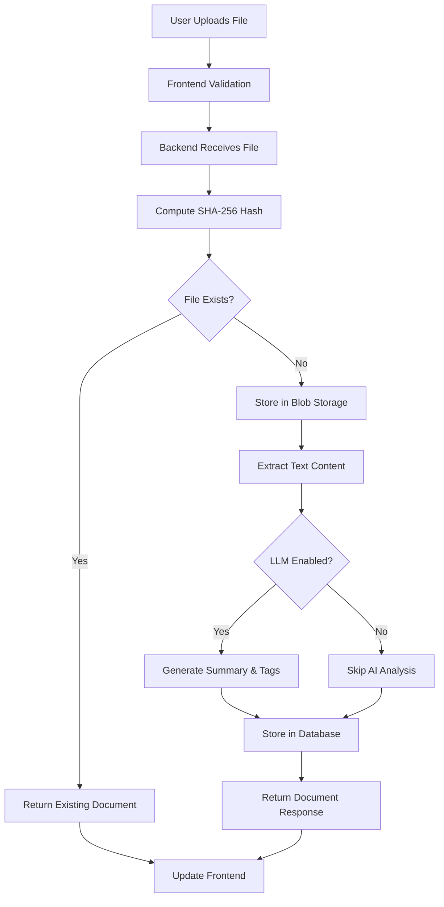
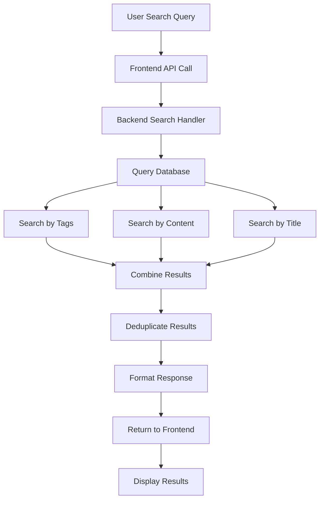
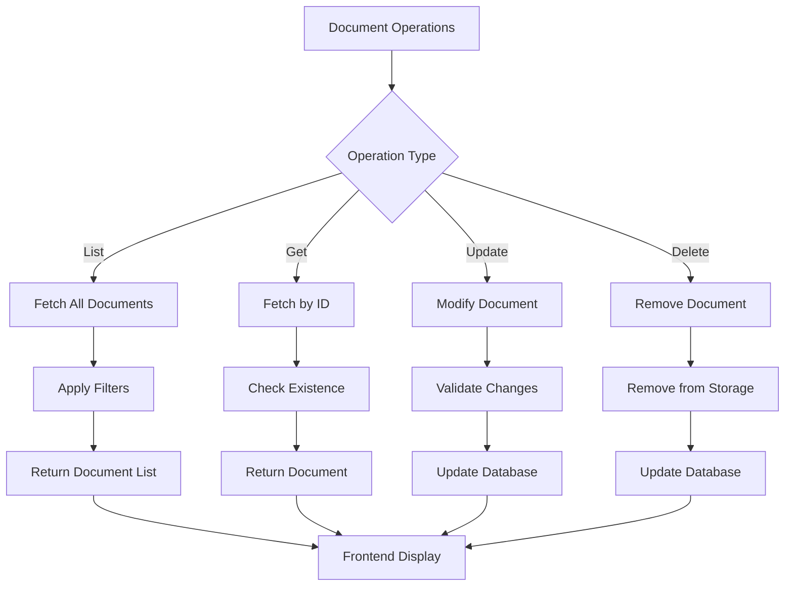
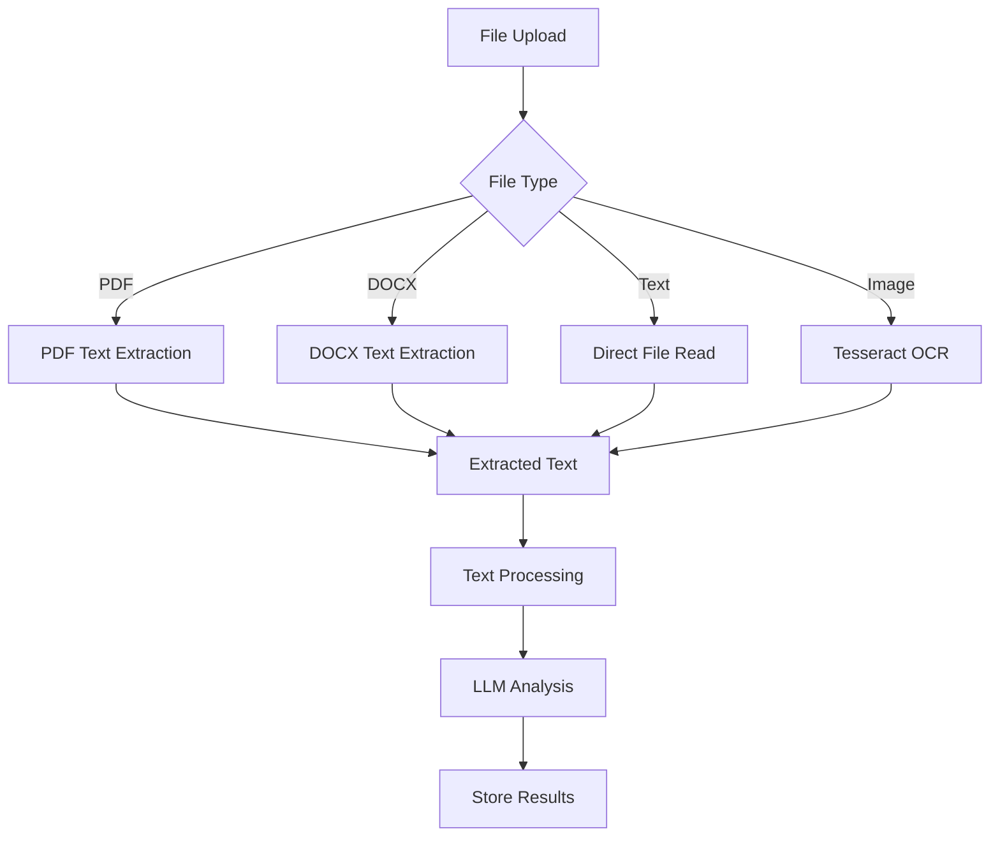

# ArgosOS Architecture Documentation

## 🏗️ System Overview

ArgosOS is an intelligent document management system that combines modern web technologies with AI-powered analysis. The system consists of a FastAPI backend for document processing and storage, and a React frontend for user interaction.

### **High-Level Architecture**

```
┌─────────────────────────────────────────────────────────────────────────────┐
│                                ARGOSOS                                    │
├─────────────────────────────────────────────────────────────────────────────┤
│                                                                             │
│  ┌─────────────────┐    ┌─────────────────┐    ┌─────────────────────────┐ │
│  │   Frontend      │    │    Backend      │    │      Storage            │ │
│  │   (React)       │◄──►│   (FastAPI)     │◄──►│   (SQLite + Blobs)     │ │
│  │                 │    │                 │    │                         │ │
│  │ • File Upload   │    │ • File Process  │    │ • Document Metadata    │ │
│  │ • Document View │    │ • Text Extract  │    │ • Content Blobs        │ │
│  │ • AI Search     │    │ • LLM Analysis  │    │ • Search Index         │ │
│  │ • Delete Files  │    │ • API Endpoints │    │ • File Storage         │ │
│  └─────────────────┘    └─────────────────┘    └─────────────────────────┘ │
│                                                                             │
└─────────────────────────────────────────────────────────────────────────────┘
```

## 🔄 System Dataflow

### **1. File Upload & Processing Flow**



### **2. Search & Retrieval Flow**



### **3. Document Management Flow**



## 🗄️ Database Architecture

### **Database Schema**

```sql
-- Documents Table
CREATE TABLE documents (
    id TEXT PRIMARY KEY,                    -- UUID string
    content_hash TEXT UNIQUE NOT NULL,      -- SHA-256 hash
    title TEXT NOT NULL,                    -- File name/title
    mime_type TEXT NOT NULL,                -- MIME type
    size_bytes INTEGER NOT NULL,            -- File size
    storage_path TEXT NOT NULL,             -- Blob storage path
    summary TEXT,                           -- AI-generated summary
    created_at INTEGER NOT NULL,            -- Creation timestamp (epoch ms)
    imported_at INTEGER NOT NULL            -- Import timestamp (epoch ms)
);

-- Tags Table
CREATE TABLE tags (
    id INTEGER PRIMARY KEY AUTOINCREMENT,   -- Auto-increment ID
    name TEXT UNIQUE NOT NULL               -- Tag name (lowercase)
);

-- Document-Tags Association Table
CREATE TABLE document_tags (
    document_id TEXT NOT NULL,              -- Foreign key to documents
    tag_id INTEGER NOT NULL,                -- Foreign key to tags
    PRIMARY KEY (document_id, tag_id),
    FOREIGN KEY (document_id) REFERENCES documents(id),
    FOREIGN KEY (tag_id) REFERENCES tags(id)
);

```

### **Database Indexes**

```sql
-- Performance optimization indexes
CREATE INDEX idx_documents_content_hash ON documents(content_hash);
CREATE INDEX idx_documents_created_at ON documents(created_at);
CREATE INDEX idx_documents_imported_at ON documents(imported_at);
CREATE INDEX idx_documents_mime_type ON documents(mime_type);
CREATE INDEX idx_tags_name ON tags(name);
CREATE INDEX idx_audit_log_ts_action ON audit_log(ts, action);
```

### **Storage Architecture**

```
data/
├── argos.db              # SQLite database
└── blobs/                # Content-addressed storage
    ├── 02/               # First 2 chars of SHA-256
    │   └── [hash].bin    # Actual file content
    ├── 5f/
    │   └── 5f986fa4c0eda169d89c588f3d08942edf6e49d07174a7036b1cfb30784db807
    ├── 72/
    │   └── 726df8bcc21cb319dde031e10a3ab40ee5ce4979cef01451a9be341fec8e8153
    └── ...
```

## 🔌 API Specifications

### **Base URL**
```
http://localhost:8000/v1
```

### **Authentication**
Currently, the API is open (no authentication required). Future versions will include JWT-based authentication.

### **Response Format**
All API responses follow this structure:
```json
{
  "data": <response_data>,
  "message": "Success message",
  "status": "success"
}
```

### **Error Format**
```json
{
  "detail": "Error description",
  "status_code": 400
}
```

### **1. Health Check**

#### **GET /health**
Check system health status.

**Response:**
```json
{
  "status": "healthy",
  "timestamp": "2024-01-01T00:00:00Z",
  "version": "1.0.0"
}
```

### **2. File Upload**

#### **POST /files**
Upload and process a file.

**Request:**
- **Content-Type:** `multipart/form-data`
- **Body:** File upload with `file` field

**Response:**
```json
{
  "id": "uuid-string",
  "title": "document.pdf",
  "tags": ["document", "pdf"],
  "summary": "AI-generated summary of the document content...",
  "mime_type": "application/pdf",
  "size_bytes": 1024000,
  "created_at": 1704067200000
}
```

**Supported File Types:**
- **PDF:** `application/pdf`
- **DOCX:** `application/vnd.openxmlformats-officedocument.wordprocessingml.document`
- **Text:** `text/plain`, `text/markdown`
- **Images:** `image/png`, `image/jpeg`, `image/gif`, `image/bmp`

### **3. Document Management**

#### **GET /documents**
Retrieve all documents with optional filtering.

**Query Parameters:**
- `skip` (int): Number of documents to skip (pagination)
- `limit` (int): Maximum number of documents to return
- `tags_any` (string[]): Documents with any of these tags
- `tags_all` (string[]): Documents with all of these tags
- `title_like` (string): Documents with title containing this string
- `date_from` (int): Documents imported after this timestamp
- `date_to` (int): Documents imported before this timestamp

**Response:**
```json
[
  {
    "id": "uuid-string",
    "title": "document.pdf",
    "tags": ["document", "pdf"],
    "summary": "AI-generated summary...",
    "mime_type": "application/pdf",
    "size_bytes": 1024000,
    "created_at": 1704067200000
  }
]
```

#### **GET /documents/{document_id}**
Retrieve a specific document by ID.

**Response:**
```json
{
  "id": "uuid-string",
  "title": "document.pdf",
  "tags": ["document", "pdf"],
  "summary": "AI-generated summary...",
  "mime_type": "application/pdf",
  "size_bytes": 1024000,
  "storage_path": "./data/blobs/5f/5f986fa4c0eda169d89c588f3d08942edf6e49d07174a7036b1cfb30784db807",
  "created_at": 1704067200000,
  "imported_at": 1704067200000
}
```

### **4. Search**

#### **POST /search**
Search documents by query string.

**Request:**
```json
{
  "query": "search term or question"
}
```

**Response:**
```json
{
  "documents": [
    {
      "id": "uuid-string",
      "title": "document.pdf",
      "tags": ["document", "pdf"],
      "summary": "AI-generated summary...",
      "mime_type": "application/pdf",
      "size_bytes": 1024000,
      "created_at": 1704067200000
    }
  ]
}
```

### **5. Tags**

#### **GET /tags**
Retrieve all available tags.

**Response:**
```json
[
  {
    "id": 1,
    "name": "document"
  },
  {
    "id": 2,
    "name": "pdf"
  }
]
```

#### **POST /tags**
Create a new tag.

**Request:**
```json
{
  "name": "new-tag-name"
}
```

**Response:**
```json
{
  "id": 3,
  "name": "new-tag-name"
}
```

## 🧠 LLM Integration Architecture

### **Provider Interface**

```python
class LLMProvider(ABC):
    @abstractmethod
    def is_available(self) -> bool:
        """Check if the LLM provider is available"""
        pass
    
    @abstractmethod
    def summarize(self, text: str) -> str:
        """Generate a summary of the given text"""
        pass
    
    @abstractmethod
    def generate_tags(self, text: str) -> List[str]:
        """Generate tags for the given text"""
        pass
```

### **OpenAI Provider**

```python
class OpenAIProvider(LLMProvider):
    def __init__(self):
        self.api_key = settings.openai_api_key
        self.model = settings.openai_model
    
    def summarize(self, text: str) -> str:
        # Generate concise summary using GPT
        # Current implementation: Simple word limit
        # Future: OpenAI API integration
    
    def generate_tags(self, text: str) -> List[str]:
        # Generate relevant tags using GPT
        # Current implementation: Keyword-based
        # Future: OpenAI API integration
```

### **Disabled Provider**

```python
class DisabledLLMProvider(LLMProvider):
    """Fallback when LLM is not configured"""
    def is_available(self) -> bool:
        return False
    
    def summarize(self, text: str) -> str:
        return ""
    
    def generate_tags(self, text: str) -> List[str]:
        return []
```

## 🔧 File Processing Pipeline

### **Text Extraction**



### **Content Deduplication**

```python
def compute_bytes_hash(file_data: bytes) -> str:
    """Compute SHA-256 hash of file content"""
    return hashlib.sha256(file_data).hexdigest()

def check_duplicate(content_hash: str) -> Optional[Document]:
    """Check if file with same content already exists"""
    return DocumentCRUD.get_by_hash(db, content_hash)
```

## 🎨 Frontend Architecture

### **Component Structure**

```
src/
├── components/           # Reusable UI components
│   ├── FileCard.tsx     # Document display card
│   ├── FileUpload.tsx   # File upload component
│   ├── SearchResultCard.tsx # Search result display
│   └── Sidebar.tsx      # Navigation sidebar
├── pages/               # Page components
│   ├── Home.tsx         # Landing page with upload
│   ├── Documents.tsx    # Document management
│   ├── Search.tsx       # AI-powered search
│   └── Settings.tsx     # Configuration settings
├── store/               # State management
│   └── useConfigStore.ts # Configuration store
├── lib/                 # Utility libraries
│   ├── api.ts          # API client wrapper
│   └── utils.ts        # Utility functions
└── App.tsx             # Main app component
```

### **State Management**

```typescript
// Zustand store for configuration
interface ConfigStore {
  apiBaseUrl: string;
  openaiApiKey: string;
  setApiBaseUrl: (url: string) => void;
  setOpenaiApiKey: (key: string) => void;
  testConnection: () => Promise<boolean>;
}

// Persistent storage with localStorage
export const useConfigStore = create<ConfigStore>()(
  persist(
    (set, get) => ({
      apiBaseUrl: 'http://localhost:8000',
      openaiApiKey: '',
      setApiBaseUrl: (url) => set({ apiBaseUrl: url }),
      setOpenaiApiKey: (key) => set({ openaiApiKey: key }),
      testConnection: async () => {
        // Test API connection
      }
    }),
    {
      name: 'argos-config',
    }
  )
);
```

### **API Client**

```typescript
// Axios-based API client
export const apiClient = {
  health: () => api.get('/health'),
  upload: (file: File) => {
    const formData = new FormData();
    formData.append('file', file);
    return api.post('/files', formData);
  },
  getDocuments: () => api.get('/documents'),
  search: (query: string) => api.post('/search', { query }),
  getTags: () => api.get('/tags'),
  createTag: (name: string) => api.post('/tags', { name })
};
```

## 🚀 Deployment Architecture

### **Development Environment**

```
┌─────────────────┐    ┌─────────────────┐    ┌─────────────────┐
│   Frontend      │    │    Backend      │    │    Database     │
│   (Vite Dev)    │    │   (Uvicorn)     │    │   (SQLite)      │
│   Port: 5173    │◄──►│   Port: 8000    │◄──►│   Local File    │
└─────────────────┘    └─────────────────┘    └─────────────────┘
```

### **Production Environment**

```
┌─────────────────┐    ┌─────────────────┐    ┌─────────────────┐
│   Frontend      │    │    Backend      │    │    Database     │
│   (Static Host) │    │   (Uvicorn)     │    │   (SQLite/      │
│   (Nginx/CDN)   │◄──►│   (Gunicorn)    │◄──►│    PostgreSQL)  │
└─────────────────┘    └─────────────────┘    └─────────────────┘
```

### **Container Deployment**

```dockerfile
# Backend Dockerfile
FROM python:3.11-slim

WORKDIR /app
COPY requirements.txt .
RUN pip install -r requirements.txt

COPY . .
EXPOSE 8000

CMD ["uvicorn", "app.main:app", "--host", "0.0.0.0", "--port", "8000"]
```

```yaml
# Docker Compose
version: '3.8'
services:
  backend:
    build: .
    ports:
      - "8000:8000"
    volumes:
      - ./data:/app/data
    environment:
      - DATABASE_URL=sqlite:///./data/argos.db
  
  frontend:
    build: ./frontend
    ports:
      - "80:80"
    depends_on:
      - backend
```

## 🔒 Security Considerations

### **File Upload Security**
- **File Type Validation**: Whitelist of allowed MIME types
- **Size Limits**: Configurable maximum file sizes
- **Content Scanning**: Future malware detection integration
- **Path Traversal Prevention**: Secure file path handling

### **API Security**
- **Input Validation**: Pydantic schema validation
- **SQL Injection Prevention**: Parameterized queries only
- **CORS Configuration**: Configurable cross-origin settings
- **Rate Limiting**: Future implementation

### **Data Security**
- **Content Hashing**: SHA-256 for integrity verification
- **Secure Storage**: Content-addressed blob storage
- **Audit Logging**: Complete action tracking
- **Access Control**: Future user authentication

## 📊 Performance Characteristics

### **Database Performance**
- **Indexing Strategy**: Optimized for common query patterns
- **Connection Pooling**: SQLAlchemy session management
- **Query Optimization**: Efficient JOIN operations

### **File Processing**
- **Asynchronous Processing**: Non-blocking file operations
- **Content Deduplication**: Prevents storage waste
- **Streaming Uploads**: Memory-efficient file handling

### **Search Performance**
- **Text Indexing**: Full-text search capabilities
- **Tag-based Filtering**: Fast document categorization
- **Result Caching**: Future Redis integration

## 🔮 Future Enhancements

### **Short Term (1-3 months)**
- [ ] User authentication and authorization
- [ ] Advanced search with vector embeddings
- [ ] Document versioning and history
- [ ] Batch file processing
- [ ] API rate limiting

### **Medium Term (3-6 months)**
- [ ] Multi-tenant architecture
- [ ] Advanced OCR with layout analysis
- [ ] Document collaboration features
- [ ] Mobile application
- [ ] Integration with cloud storage

### **Long Term (6+ months)**
- [ ] Machine learning model training
- [ ] Advanced document analytics
- [ ] Workflow automation
- [ ] Enterprise features
- [ ] Global deployment

## 🧪 Testing Strategy

### **Backend Testing**
```bash
# Unit tests
pytest tests/unit/

# Integration tests
pytest tests/integration/

# API tests
pytest tests/api/

# Coverage report
pytest --cov=app --cov-report=html
```

### **Frontend Testing**
```bash
# Component tests
npm run test:components

# Integration tests
npm run test:integration

# E2E tests
npm run test:e2e
```

### **Performance Testing**
```bash
# Load testing
locust -f tests/load/locustfile.py

# Stress testing
artillery run tests/performance/stress.yml
```

## 📚 Additional Resources

### **Documentation**
- [FastAPI Documentation](https://fastapi.tiangolo.com/)
- [React Documentation](https://react.dev/)
- [SQLAlchemy Documentation](https://docs.sqlalchemy.org/)
- [Tailwind CSS Documentation](https://tailwindcss.com/docs)

### **Development Tools**
- **Backend**: PyCharm, VS Code, Vim
- **Frontend**: VS Code, WebStorm, Chrome DevTools
- **Database**: SQLite Browser, DBeaver
- **API Testing**: Postman, Insomnia, curl

### **Monitoring & Logging**
- **Application Logs**: Python logging, console output
- **Performance Monitoring**: Future Prometheus integration
- **Error Tracking**: Future Sentry integration
- **Health Checks**: Built-in health endpoint

---

*This architecture document provides a comprehensive overview of the ArgosOS system. For specific implementation details, refer to the individual component documentation and source code.*


