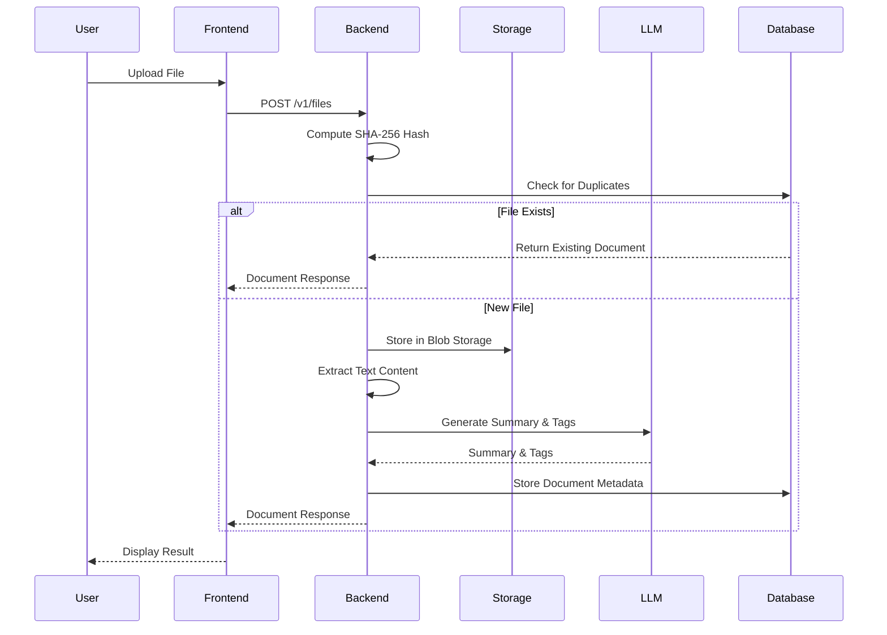
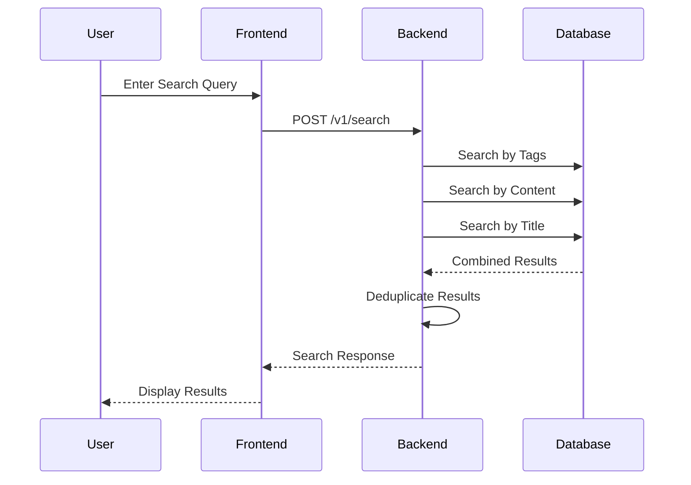
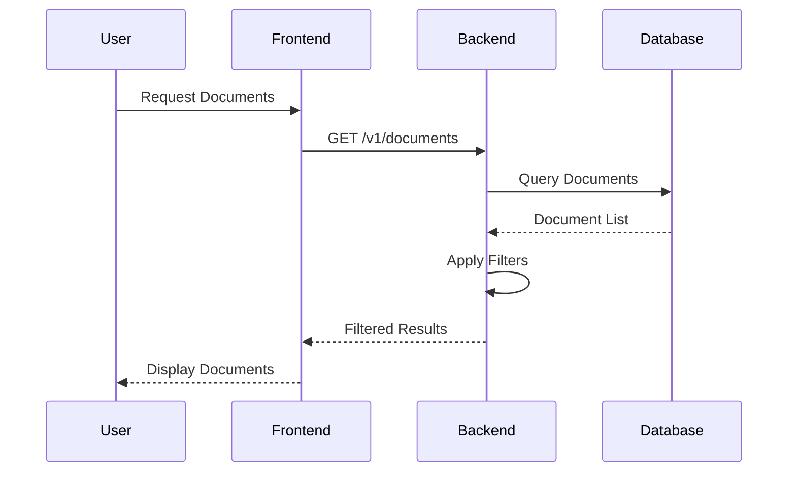
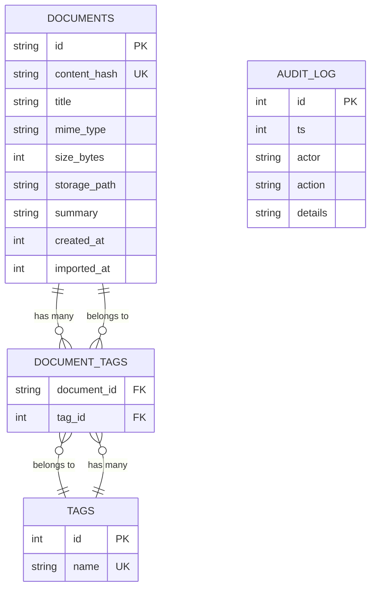
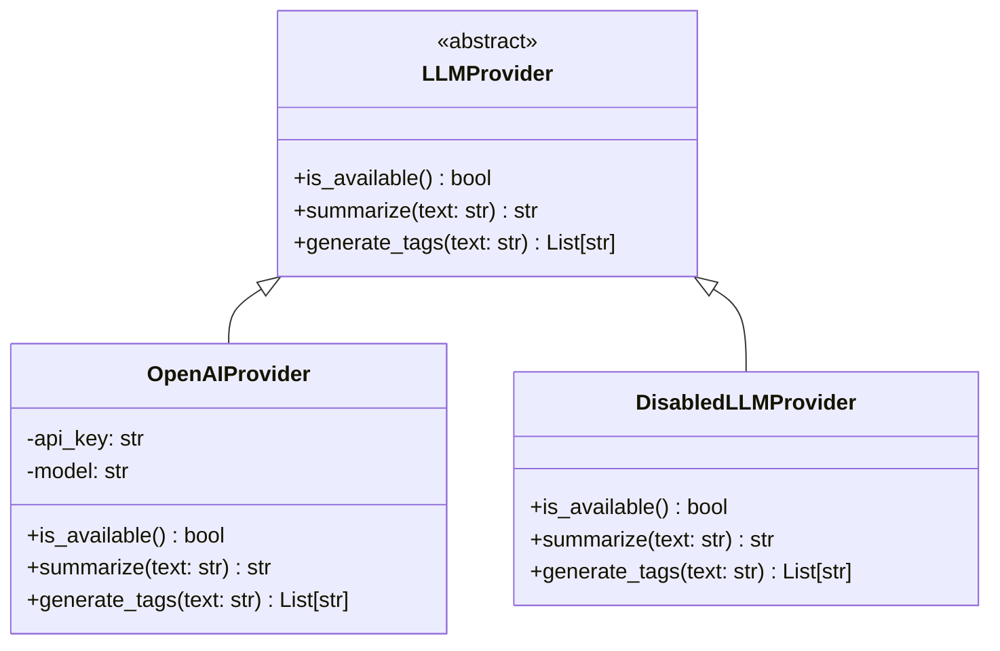

# ArgosOS Visual Architecture Diagrams

## 🏗️ System Architecture Overview

### **High-Level System Architecture**
```
┌─────────────────────────────────────────────────────────────────────────────┐
│                                ARGOSOS                                    │
├─────────────────────────────────────────────────────────────────────────────┤
│                                                                             │
│  ┌─────────────────┐    ┌─────────────────┐    ┌─────────────────────────┐ │
│  │   Frontend      │    │    Backend      │    │      Storage            │ │
│  │   (React)       │◄──►│   (FastAPI)     │◄──►│   (SQLite + Blobs)     │ │
│  │                 │    │                 │    │                         │ │
│  │ • File Upload   │    │ • File Process  │    │ • Document Metadata    │ │
│  │ • Document View │    │ • Text Extract  │    │ • Content Blobs        │ │
│  │ • AI Search     │    │ • LLM Analysis  │    │ • Search Index         │ │
│  │ • Settings      │    │ • API Endpoints │    │ • Audit Logs           │ │
│  └─────────────────┘    └─────────────────┘    └─────────────────────────┘ │
│                                                                             │
└─────────────────────────────────────────────────────────────────────────────┘
```

### **Detailed Component Architecture**
```
┌─────────────────────────────────────────────────────────────────────────────┐
│                              FRONTEND LAYER                               │
├─────────────────────────────────────────────────────────────────────────────┤
│                                                                             │
│  ┌─────────────┐  ┌─────────────┐  ┌─────────────┐  ┌─────────────┐      │
│  │    Home     │  │ Documents   │  │   Search    │  │  Settings   │      │
│  │   Page      │  │   Page      │  │    Page     │  │    Page     │      │
│  └─────────────┘  └─────────────┘  └─────────────┘  └─────────────┘      │
│         │                │                │                │              │
│         └────────────────┼────────────────┼────────────────┘              │
│                          │                │                                │
│  ┌─────────────┐  ┌─────────────┐  ┌─────────────┐  ┌─────────────┐      │
│  │ FileUpload  │  │  FileCard   │  │SearchResult │  │   Sidebar   │      │
│  │ Component   │  │ Component   │  │   Card      │  │ Component   │      │
│  └─────────────┘  └─────────────┘  └─────────────┘  └─────────────┘      │
│         │                │                │                │              │
│         └────────────────┼────────────────┼────────────────┘              │
│                          │                │                                │
│  ┌─────────────┐  ┌─────────────┐  ┌─────────────┐  ┌─────────────┐      │
│  │   Zustand   │  │   Axios     │  │   Utils     │  │   Router    │      │
│  │   Store     │  │   Client    │  │  (clsx,     │  │   (React    │      │
│  │             │  │             │  │  twMerge)   │  │   Router)   │      │
│  └─────────────┘  └─────────────┘  └─────────────┘  └─────────────┘      │
│                                                                             │
└─────────────────────────────────────────────────────────────────────────────┘
                                    │
                                    ▼
┌─────────────────────────────────────────────────────────────────────────────┐
│                              BACKEND LAYER                                │
├─────────────────────────────────────────────────────────────────────────────┤
│                                                                             │
│  ┌─────────────┐  ┌─────────────┐  ┌─────────────┐  ┌─────────────┐      │
│  │   Files     │  │ Documents   │  │   Search    │  │   Health    │      │
│  │   Router    │  │   Router    │  │   Router    │  │   Router    │      │
│  └─────────────┘  └─────────────┘  └─────────────┘  └─────────────┘      │
│         │                │                │                │              │
│         └────────────────┼────────────────┼────────────────┘              │
│                          │                │                                │
│  ┌─────────────┐  ┌─────────────┐  ┌─────────────┐  ┌─────────────┐      │
│  │   File      │  │   LLM       │  │   Text      │  │   Hash      │      │
│  │  Storage    │  │ Providers   │  │ Extractors  │  │   Utils     │      │
│  └─────────────┘  └─────────────┘  └─────────────┘  └─────────────┘      │
│         │                │                │                │              │
│         └────────────────┼────────────────┼────────────────┘              │
│                          │                │                                │
│  ┌─────────────┐  ┌─────────────┐  ┌─────────────┐  ┌─────────────┐      │
│  │   CRUD      │  │   Models    │  │   Engine    │  │  Schemas    │      │
│  │ Operations  │  │ (SQLAlchemy)│  │ (SQLAlchemy)│  │ (Pydantic)  │      │
│  └─────────────┘  └─────────────┘  └─────────────┘  └─────────────┘      │
│                                                                             │
└─────────────────────────────────────────────────────────────────────────────┘
                                    │
                                    ▼
┌─────────────────────────────────────────────────────────────────────────────┐
│                              STORAGE LAYER                                │
├─────────────────────────────────────────────────────────────────────────────┤
│                                                                             │
│  ┌─────────────────────────────────────────────────────────────────────┐   │
│  │                        SQLite Database                             │   │
│  │  ┌─────────────┐  ┌─────────────┐  ┌─────────────┐  ┌─────────────┐ │   │
│  │  │ Documents   │  │    Tags     │  │DocumentTags │  │ Audit Log   │ │   │
│  │  │   Table     │  │   Table     │  │   Table     │  │   Table     │ │   │
│  │  └─────────────┘  └─────────────┘  └─────────────┘  └─────────────┘ │   │
│  └─────────────────────────────────────────────────────────────────────┘   │
│                                                                             │
│  ┌─────────────────────────────────────────────────────────────────────┐   │
│  │                     Blob Storage (File System)                     │   │
│  │  ┌─────────────┐  ┌─────────────┐  ┌─────────────┐  ┌─────────────┐ │   │
│  │  │   data/     │  │   blobs/    │  │  02/ 5f/   │  │  72/ 8d/    │ │   │
│  │  │  argos.db   │  │             │  │             │  │             │ │   │
│  │  └─────────────┘  └─────────────┘  └─────────────┘  └─────────────┘ │   │
│  └─────────────────────────────────────────────────────────────────────┘   │
│                                                                             │
└─────────────────────────────────────────────────────────────────────────────┘
```

## 🔄 Data Flow Diagrams

### **1. File Upload & Processing Flow**


### **2. Search & Retrieval Flow**


### **3. Document Management Flow**


## 🗄️ Database Schema Visualization

### **Entity Relationship Diagram**


### **Database Indexes**
```
┌─────────────────────────────────────────────────────────────────────────────┐
│                              DATABASE INDEXES                              │
├─────────────────────────────────────────────────────────────────────────────┤
│                                                                             │
│  ┌─────────────────────────────────────────────────────────────────────┐   │
│  │                        Documents Table                              │   │
│  │  ┌─────────────────┐  ┌─────────────────┐  ┌─────────────────────┐ │   │
│  │  │ content_hash    │  │   created_at    │  │     imported_at     │ │   │
│  │  │   (UNIQUE)      │  │     (INDEX)     │  │       (INDEX)       │ │   │
│  │  └─────────────────┘  └─────────────────┘  └─────────────────────┘ │   │
│  │                                                                       │   │
│  │  ┌─────────────────┐  ┌─────────────────┐                            │   │
│  │  │   mime_type     │  │   (Composite)   │                            │   │
│  │  │     (INDEX)     │  │  created_at +   │                            │   │
│  │  └─────────────────┘  │   mime_type     │                            │   │
│  └─────────────────────────────────────────────────────────────────────┘   │
│                                                                             │
│  ┌─────────────────────────────────────────────────────────────────────┐   │
│  │                         Tags Table                                   │   │
│  │  ┌─────────────────┐                                                │   │
│  │  │      name       │                                                │   │
│  │  │   (UNIQUE)      │                                                │   │
│  │  └─────────────────┘                                                │   │
│  └─────────────────────────────────────────────────────────────────────┘   │
│                                                                             │
│  ┌─────────────────────────────────────────────────────────────────────┐   │
│  │                      Audit Log Table                                │   │
│  │  ┌─────────────────┐  ┌─────────────────┐                            │   │
│  │  │       ts        │  │  (Composite)    │                            │   │
│  │  │     (INDEX)     │  │     ts +        │                            │   │
│  │  └─────────────────┘  │     action      │                            │   │
│  └─────────────────────────────────────────────────────────────────────┘   │
│                                                                             │
└─────────────────────────────────────────────────────────────────────────────┘
```

## 🔌 API Endpoint Map

### **API Structure Visualization**
```
┌─────────────────────────────────────────────────────────────────────────────┐
│                              API ENDPOINTS                                │
├─────────────────────────────────────────────────────────────────────────────┤
│                                                                             │
│  Base URL: http://localhost:8000/v1                                        │
│                                                                             │
│  ┌─────────────────────────────────────────────────────────────────────┐   │
│  │                        Health Check                                 │   │
│  │  ┌─────────────────────────────────────────────────────────────┐   │   │
│  │  │                    GET /health                              │   │   │
│  │  │              Returns system status                          │   │   │
│  │  └─────────────────────────────────────────────────────────────┘   │   │
│  └─────────────────────────────────────────────────────────────────────┘   │
│                                                                             │
│  ┌─────────────────────────────────────────────────────────────────────┐   │
│  │                        File Management                             │   │
│  │  ┌─────────────────────────────────────────────────────────────┐   │   │
│  │  │                POST /files                                 │   │   │
│  │  │           Upload and process files                          │   │   │
│  │  └─────────────────────────────────────────────────────────────┘   │   │
│  └─────────────────────────────────────────────────────────────────────┘   │
│                                                                             │
│  ┌─────────────────────────────────────────────────────────────────────┐   │
│  │                      Document Management                           │   │
│  │  ┌─────────────────────────────────────────────────────────────┐   │   │
│  │  │              GET /documents                                 │   │   │
│  │  │           List all documents                                │   │   │
│  │  │                                                             │   │   │
│  │  │           GET /documents/{id}                               │   │   │
│  │  │         Get specific document                               │   │   │
│  │  └─────────────────────────────────────────────────────────────┘   │   │
│  └─────────────────────────────────────────────────────────────────────┘   │
│                                                                             │
│  ┌─────────────────────────────────────────────────────────────────────┐   │
│  │                           Search                                   │   │
│  │  ┌─────────────────────────────────────────────────────────────┐   │   │
│  │  │                POST /search                                 │   │   │
│  │  │           Search documents by query                         │   │   │
│  │  └─────────────────────────────────────────────────────────────┘   │   │
│  └─────────────────────────────────────────────────────────────────────┘   │
│                                                                             │
│  ┌─────────────────────────────────────────────────────────────────────┐   │
│  │                            Tags                                    │   │
│  │  ┌─────────────────────────────────────────────────────────────┐   │   │
│  │  │                 GET /tags                                   │   │   │
│  │  │              List all tags                                  │   │   │
│  │  │                                                             │   │   │
│  │  │                POST /tags                                   │   │   │
│  │  │              Create new tag                                 │   │   │
│  │  └─────────────────────────────────────────────────────────────┘   │   │
│  └─────────────────────────────────────────────────────────────────────┘   │
│                                                                             │
└─────────────────────────────────────────────────────────────────────────────┘
```

## 🧠 LLM Integration Architecture

### **LLM Provider Pattern**


### **LLM Processing Flow**
```
┌─────────────────────────────────────────────────────────────────────────────┐
│                           LLM PROCESSING FLOW                             │
├─────────────────────────────────────────────────────────────────────────────┤
│                                                                             │
│  ┌─────────────┐    ┌─────────────┐    ┌─────────────┐    ┌─────────────┐  │
│  │   Text      │───▶│   LLM       │───▶│  Summary    │───▶│   Store     │  │
│  │ Extraction  │    │  Provider   │    │ Generation  │    │  Results    │  │
│  └─────────────┘    └─────────────┘    └─────────────┘    └─────────────┘  │
│         │                   │                   │                   │      │
│         ▼                   ▼                   ▼                   ▼      │
│  ┌─────────────┐    ┌─────────────┐    ┌─────────────┐    ┌─────────────┐  │
│  │   OCR       │    │   OpenAI    │    │   GPT       │    │  Database   │  │
│  │  (Images)   │    │   Provider  │    │  Model      │    │  Update     │  │
│  └─────────────┘    └─────────────┘    └─────────────┘    └─────────────┘  │
│                                                                             │
│  ┌─────────────┐    ┌─────────────┐    ┌─────────────┐    ┌─────────────┐  │
│  │   PDF       │    │  Disabled   │    │   Simple    │    │  Tag        │  │
│  │  Parser     │    │  Provider   │    │  Fallback   │    │  Creation   │  │
│  └─────────────┘    └─────────────┘    └─────────────┘    └─────────────┘  │
│                                                                             │
└─────────────────────────────────────────────────────────────────────────────┘
```

## 🎨 Frontend Component Hierarchy

### **Component Tree Structure**
```
┌─────────────────────────────────────────────────────────────────────────────┐
│                        FRONTEND COMPONENT TREE                            │
├─────────────────────────────────────────────────────────────────────────────┘
│                                                                             │
│  App.tsx                                                                   │
│  ├── Router                                                                │
│  │   ├── Sidebar                                                           │
│  │   │   ├── Navigation Items                                              │
│  │   │   └── Bottom Decoration                                            │
│  │   │                                                                     │
│  │   ├── Home Page                                                         │
│  │   │   ├── Hero Section                                                  │
│  │   │   ├── FileUpload Component                                          │
│  │   │   │   ├── Drag & Drop Area                                         │
│  │   │   │   ├── File Validation                                          │
│  │   │   │   └── Upload Progress                                          │
│  │   │   │                                                                 │
│  │   │   ├── Recent Uploads                                                │
│  │   │   │   └── FileCard Components                                      │
│  │   │   │       ├── Document Info                                        │
│  │   │   │       ├── Tags Display                                         │
│  │   │   │       └── Action Buttons                                       │
│  │   │   │                                                                 │
│  │   │   └── Features Section                                              │
│  │   │                                                                     │
│  │   ├── Documents Page                                                    │
│  │   │   ├── Header Section                                                │
│  │   │   ├── Search & Filter Controls                                      │
│  │   │   ├── View Mode Toggle                                              │
│  │   │   └── Document Grid/List                                            │
│  │   │       └── FileCard Components                                      │
│  │   │                                                                     │
│  │   ├── Search Page                                                       │
│  │   │   ├── Search Input                                                  │
│  │   │   ├── Search Tips                                                   │
│  │   │   ├── Results Display                                              │
│  │   │   │   └── SearchResultCard Components                              │
│  │   │   └── Empty/Error States                                           │
│  │   │                                                                     │
│  │   └── Settings Page                                                     │
│   │       ├── API Configuration                                            │
│   │       ├── OpenAI Setup                                                 │
│   │       └── Connection Testing                                           │
│   │                                                                        │
│   └── Global State (Zustand)                                               │
│       ├── Configuration Store                                               │
│       │   ├── API Base URL                                                 │
│       │   ├── OpenAI API Key                                               │
│       │   └── Connection Testing                                           │
│       └── Local Storage Persistence                                        │
│                                                                             │
└─────────────────────────────────────────────────────────────────────────────┘
```

## 🚀 Deployment Architecture

### **Development Environment**
```
┌─────────────────────────────────────────────────────────────────────────────┐
│                          DEVELOPMENT SETUP                                 │
├─────────────────────────────────────────────────────────────────────────────┤
│                                                                             │
│  ┌─────────────────┐    ┌─────────────────┐    ┌─────────────────────────┐ │
│  │   Frontend      │    │    Backend      │    │      Storage            │ │
│  │   (Vite Dev)    │◄──►│   (Uvicorn)     │◄──►│   (SQLite)             │ │
│  │   Port: 5173    │    │   Port: 8000    │    │   Local File           │ │
│  │                 │    │   --reload      │    │   ./data/               │ │
│  │ • Hot Reload    │    │                 │    │                         │ │
│  │ • Fast Refresh  │    │ • Auto Restart  │    │ • argos.db              │ │
│  │ • Dev Tools     │    │ • Debug Mode    │    │ • blobs/                │ │
│  └─────────────────┘    └─────────────────┘    └─────────────────────────┘ │
│                                                                             │
│  ┌─────────────────────────────────────────────────────────────────────┐   │
│  │                        Development Tools                            │   │
│  │  ┌─────────────┐  ┌─────────────┐  ┌─────────────┐  ┌─────────────┐ │   │
│  │  │   Browser   │  │   Terminal  │  │   Database  │  │   Code      │ │   │
│  │  │   DevTools  │  │   (uvicorn) │  │   Browser   │  │   Editor    │ │   │
│  │  └─────────────┘  └─────────────┘  └─────────────┘  └─────────────┘ │   │
│  └─────────────────────────────────────────────────────────────────────┘   │
│                                                                             │
└─────────────────────────────────────────────────────────────────────────────┘
```

### **Production Environment**
```
┌─────────────────────────────────────────────────────────────────────────────┐
│                          PRODUCTION SETUP                                 │
├─────────────────────────────────────────────────────────────────────────────┤
│                                                                             │
│  ┌─────────────────┐    ┌─────────────────┐    ┌─────────────────────────┐ │
│  │   Frontend      │    │    Backend      │    │      Storage            │ │
│  │   (Static)      │◄──►│   (Gunicorn)    │◄──►│   (PostgreSQL)         │ │
│  │   (Nginx/CDN)   │    │   (Multiple     │    │   (Managed DB)         │ │
│  │                 │    │    Workers)     │    │                         │ │
│  │ • Optimized     │    │                 │    │ • Connection Pool      │ │
│  │ • Compressed    │    │ • Load Balanced │    │ • Backup & Recovery    │ │
│  │ • Cached        │    │ • Monitored     │    │ • Scaling              │ │
│  └─────────────────┘    └─────────────────┘    └─────────────────────────┘ │
│                                                                             │
│  ┌─────────────────────────────────────────────────────────────────────┐   │
│  │                        Infrastructure                               │   │
│  │  ┌─────────────┐  ┌─────────────┐  ┌─────────────┐  ┌─────────────┐ │   │
│  │  │   Load      │  │   Reverse   │  │   SSL       │  │   Monitoring│ │   │
│  │  │  Balancer   │  │    Proxy    │  │  Certificate│  │   & Logging │ │   │
│  │  └─────────────┘  └─────────────┘  └─────────────┘  └─────────────┘ │   │
│  └─────────────────────────────────────────────────────────────────────┘   │
│                                                                             │
└─────────────────────────────────────────────────────────────────────────────┘
```

## 🔒 Security Architecture

### **Security Layers**
```
┌─────────────────────────────────────────────────────────────────────────────┐
│                            SECURITY LAYERS                                │
├─────────────────────────────────────────────────────────────────────────────┤
│                                                                             │
│  ┌─────────────────────────────────────────────────────────────────────┐   │
│  │                        Application Layer                            │   │
│  │  ┌─────────────┐  ┌─────────────┐  ┌─────────────┐  ┌─────────────┐ │   │
│  │  │   Input     │  │   Output    │  │   Session   │  │   Access    │ │   │
│  │  │ Validation  │  │ Sanitization│  │ Management  │  │   Control   │ │   │
│  │  └─────────────┘  └─────────────┘  └─────────────┘  └─────────────┘ │   │
│  └─────────────────────────────────────────────────────────────────────┘   │
│                                                                             │
│  ┌─────────────────────────────────────────────────────────────────────┐   │
│  │                         Network Layer                               │   │
│  │  ┌─────────────┐  ┌─────────────┐  ┌─────────────┐  ┌─────────────┐ │   │
│  │  │     CORS    │  │   Rate      │  │   SSL/TLS   │  │   Firewall  │ │   │
│  │  │  Settings   │  │  Limiting   │  │  Encryption │  │   Rules     │ │   │
│  │  └─────────────┘  └─────────────┘  └─────────────┘  └─────────────┘ │   │
│  └─────────────────────────────────────────────────────────────────────┘   │
│                                                                             │
│  ┌─────────────────────────────────────────────────────────────────────┐   │
│  │                         Data Layer                                  │   │
│  │  ┌─────────────┐  ┌─────────────┐  ┌─────────────┐  ┌─────────────┐ │   │
│  │  │   Content   │  │   Audit     │  │   Data      │  │   Backup    │ │   │
│  │  │   Hashing   │  │   Logging   │  │ Encryption  │  │   Security  │ │   │
│  │  └─────────────┘  └─────────────┘  └─────────────┘  └─────────────┘ │   │
│  └─────────────────────────────────────────────────────────────────────┘   │
│                                                                             │
└─────────────────────────────────────────────────────────────────────────────┘
```

---

*These visual diagrams provide a comprehensive understanding of the ArgosOS architecture. Use them alongside the detailed architecture documentation for complete system comprehension.*


